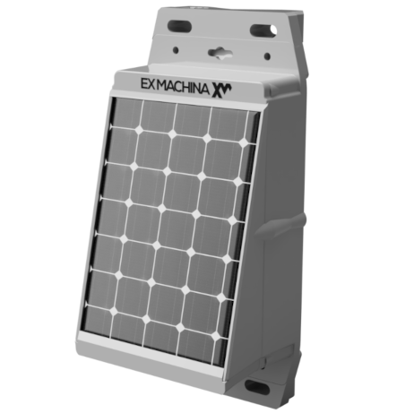
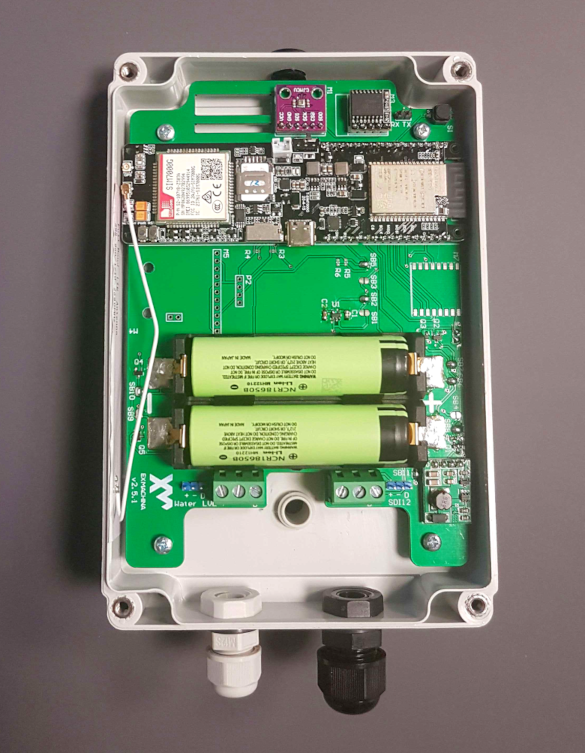

# AgroXM Weather Station

## Initialization
The preparation of the weather station for deployment consists of the following steps:
1. Flash firmware
    * Set up Thingsboard server URL in the firmware
    * Flash
2. Create Thingsboard device for weather station
3. Boot device in config mode to set Thingsboard device access token and cellular network APN

### Flashing firmware
Open the project in [PlatformIO](https://platformio.org), navigate to **includes/credentials.h** and update the following:

* **TB_SERVER/TB_PORT** Thingsboard server URL/port
* **FALLBACK_TB_DEVICE_TOKEN** Token of the Thingsboard device to fall back to when communication fails with the set token or configuration memory is corrupted.
Note that these variables are defined separately for **debug** and **release** builds.

When done build and flash.

### Setting up device config
To configure device specific settings, the weather station must be booted in config mode while connected via USB to a serial monitor like [PuTTY](https://www.putty.org) or [Minicom](https://www.putty.org). To enter config mode hold the the config mode button on the top right of the PCB and power cycle the device. The on board LED will flash three times to denote that device has booted in config mode.
Enter the following commands (values are entered without brackets):

    TB_DEVICE_TOKEN=[your tb device token]

    APN=[cellular network APN]

To confirm that variable values have been set correctly, they can be read back by appending a questino mark at the end:

    TB_DEVICE_TOKEN=?

    APN=?

